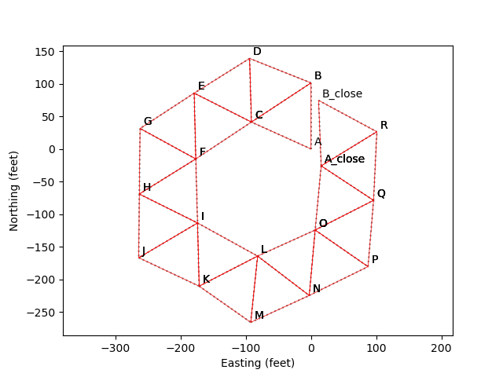
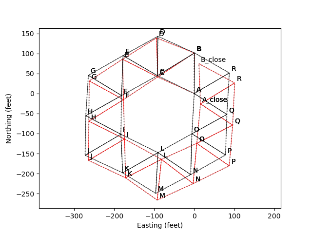

# triangle_survey
Do survey computations for a measured triangular grid

## Motivation ## 
This is useful for someone who wants reasonably good angular measurements in a
survey, and can afford a long tape measure but not a theodolite.  For angular
measurements better than a quarter of a degree (15 arc minutes), even an old
theodolite on ebay can run a few hundred dollars.  A long tape measure (100 foot
steel tape, for example) can be found for around $25.

## Example ##
As an example, we consider a loop of triangles.  We start at points A and B, and
measure triangles until we get back to those points.  In the survey file, we
label the points A_close and B_close when returning to them, so that we can
determine the level of error in the survey.  In the figure below, I use 100 foot
equilateral triangles to make the loop, and give each of the edges 3% error in
length measurements.  This error is exaggerated for purposes of making a figure.
Steel tape measures should have accuracies somewhere between 0.1% and 0.001%,
depending on how careful you are (are you measuring tension in the tape,
temperature of the tape, sag in the tape, levelness of the tape?).

By looking at how far away the points A and A_close (and B and B_close) are from each other, one can
get a good estimate of the accuracy of the survey.

Next, I require A and A_close to be the same point, and I require B and B_close
to be the same point, and I use scipy.optimize.leastsq to find a least squares
solution for all the point locations.  This gives the following result in black,
overlayed on the first:

While the axes are labeled "Easting" and "Northing", that is misleading because
the figure is not yet properly rotated.  If an angular measurement is available
with a magnetic compass, GPS, or overlay on Google Earth, then the triangles can
be rotated to align with other maps.

## File Format Details ## 
See survey2.dat for an example file.

The control point section of the file contains a list of triangles, listed by
point labels.  This is necessary to get the original configuration of triangles,
which lets you estimate error in the survey, as well as provide an initial
condition for the least squares fitting.  The triangle points are labeled
counterclockwise, as seen from above the Earth looking downward (as one would
look at a map).

Point labels can be any string of non-whitespace characters.  I used mostly
single letters for simplicity and ease of labeling on maps, but one could also
use NorthwestCornerOfFencePost17 if desired.

After listing the triangles (or interspersed with listing the triangles), are
the measured distances between points.  A line like:
    A B = 100.0
means the distance between points A and B is 100 feet.  Units are arbitrary, but
they should be consistent throughout the file.

## Other ## 

The user interface still involves hand editing triangle_survey.py.  I'll fix
that eventually.

This survey program will assume all measurements are horizontal, and none are
made with the tape measure sloping upward or downward, such as may happen if the
surveyed area is on a hill.

